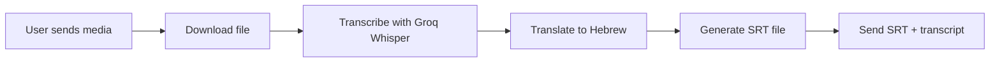

# ⚡ Hebrew Subtitle Bot - SRT Fast Version

> Lightning-fast Telegram bot that transcribes English videos and generates Hebrew subtitle files (SRT) using Groq Whisper AI

[](https://www.python.org/downloads/)
[](https://core.telegram.org/bots/api)
[](https://groq.com/)
[](https://opensource.org/licenses/MIT)

---

## ✨ Features

- 🎤 **Accurate Transcription** - Uses Groq's Whisper-large-v3 for high-quality transcription
- 🌐 **Free Translation** - Automatically translates English to Hebrew using Google Translate
- ⚡ **Lightning Fast** - Get SRT file in seconds (5-minute video = ~30 seconds)
- 📄 **Standard SRT Format** - Compatible with all video editors and players
- 🎨 **Flexible Styling** - Customize subtitles in CapCut, Premiere Pro, or any video editor
- 🆓 **Completely Free** - No API costs (14,400 minutes/month free on Groq)
- 📱 **Easy Integration** - Import SRT into CapCut with one click
- 🎬 **No Size Limit** - Works with videos of any length

---

## 🎯 Best For

- ✅ **All video lengths** - No processing timeout issues
- ✅ **Fast turnaround** - Get subtitles in seconds
- ✅ **Custom styling** - Full control over subtitle appearance
- ✅ **Batch processing** - Process multiple videos quickly
- ✅ **Professional workflow** - Standard SRT format

**Want subtitles burned into video?** Check out the [Video Burn Version](https://github.com/YOUR_USERNAME/hebrew-subtitle-bot-burn)

---

## 📋 Prerequisites

Before you begin, you'll need:

1. **Telegram Bot Token**
   - Talk to [@BotFather](https://t.me/BotFather) on Telegram
   - Send `/newbot` and follow instructions
   - Save your token (looks like: `1234567890:ABCdef...`)

2. **Groq API Key** (Free!)
   - Sign up at [console.groq.com](https://console.groq.com)
   - Create an API key
   - Free tier: 14,400 minutes/month

---

## 🚀 Quick Deploy to Render (Free!)

### Step 1: Fork or Clone This Repository

```bash
git clone https://github.com/YOUR_USERNAME/hebrew-subtitle-bot-srt.git
cd hebrew-subtitle-bot-srt
```

### Step 2: Deploy to Render

1. Go to [render.com](https://render.com) and sign up (free)
2. Click **New +** → **Web Service**
3. Connect your GitHub repository
4. Configure:
   - **Name**: `hebrew-subtitle-bot-srt` (or any name)
   - **Region**: Choose closest to you
   - **Branch**: `main`
   - **Runtime**: Docker
   - **Instance Type**: **Free**

5. Add Environment Variables:
   ```
   TELEGRAM_TOKEN=your_telegram_bot_token
   GROQ_API_KEY=your_groq_api_key
   ```

6. Click **Create Web Service**
7. Wait 5-10 minutes for deployment
8. ✅ Your bot is live!

---

## 💻 Local Development

### Installation

```bash
# Clone the repository
git clone https://github.com/YOUR_USERNAME/hebrew-subtitle-bot-srt.git
cd hebrew-subtitle-bot-srt

# Install dependencies
pip install -r requirements.txt
```

### Configuration

1. Copy the example environment file:
   ```bash
   cp .env.example .env
   ```

2. Edit `.env` and add your credentials:
   ```env
   TELEGRAM_TOKEN=your_telegram_bot_token_here
   GROQ_API_KEY=your_groq_api_key_here
   ```

3. Run the bot:
   ```bash
   python bot_srt_only.py
   ```

---

## 📖 Usage

### Basic Usage

1. Start a chat with your bot on Telegram
2. Send `/start` to see the welcome message
3. Send a video, audio, or voice message
4. Receive an SRT file in seconds!
5. Import the SRT into your video editor

### Example Flow

```
User: [Sends 5-minute video in English]
Bot: ⏳ מעבד את הקובץ...
Bot: 🎤 מתמלל... (זה יכול לקחת כמה שניות)
Bot: 🌐 מתרגם לעברית ויוצר קובץ SRT...
Bot: [Sends subtitles_hebrew.srt file]
Bot: 📝 *התמליל המלא בעברית:*
     [Shows full transcription text]
```

---

## 🎬 How to Add SRT to Video

### Option 1: CapCut (Mobile - Easiest!)

**Download:** [CapCut on Google Play](https://play.google.com/store/apps/details?id=com.lemon.lvoverseas)

1. Open CapCut app
2. Create new project → Select your video
3. Tap **Text** at bottom menu
4. Select **Import Captions** or **ייבוא כתוביות**
5. Choose the SRT file the bot sent you
6. ✨ **Done!** Subtitles appear automatically with correct timing
7. Customize styling (color, font, size, position)
8. Export your video

**Video Tutorial:** Search YouTube for "CapCut import SRT subtitles"

### Option 2: DaVinci Resolve (Desktop - Free & Professional)

1. Import your video
2. File → Import → Subtitle
3. Select the SRT file
4. Subtitles appear on timeline
5. Customize in the subtitle panel
6. Export

### Option 3: Premiere Pro / Final Cut Pro

**Premiere Pro:**
- Window → Text → Captions
- Import SRT file
- Customize styling

**Final Cut Pro:**
- Import as captions
- Edit in captions inspector

---

## ⚙️ How It Works



1. **Input**: Accepts video, audio, or voice messages
2. **Transcription**: Groq Whisper-large-v3 processes audio (super fast!)
3. **Translation**: Google Translate converts English to Hebrew
4. **SRT Generation**: Creates properly formatted subtitle file with timestamps
5. **Output**: Returns SRT file + full text transcript

---

## 📁 Project Structure

```
hebrew-subtitle-bot-srt/
├── bot_srt_only.py       # Main bot code
├── requirements.txt       # Python dependencies
├── Dockerfile            # Docker configuration (lightweight)
├── .dockerignore         # Files to exclude from Docker
├── .gitignore            # Files to exclude from Git
├── .env.example          # Environment variables template
├── README.md             # This file
└── LICENSE               # MIT License
```

---

## 📊 Performance Comparison

| Video Length | Processing Time | Output |
|--------------|----------------|--------|
| 1 minute | ~10 seconds | SRT file |
| 5 minutes | ~30 seconds | SRT file |
| 10 minutes | ~1 minute | SRT file |
| 30 minutes | ~3 minutes | SRT file |
| 1 hour | ~5-6 minutes | SRT file |

**Note:** Times may vary based on server load and audio clarity.

---

## 🔧 Troubleshooting

### Bot doesn't respond
- Check that the service is running on Render (status should be green)
- Verify environment variables are set correctly
- Check logs in Render dashboard
- Try sending `/start` to wake the bot

### "Groq API error"
- Verify your API key at [console.groq.com](https://console.groq.com)
- Check if you've exceeded the monthly quota (14,400 minutes)
- Ensure the audio is clear and in English
- Try creating a new API key

### Translation issues
- Google Translate provides basic translation
- For better quality, consider implementing Claude API or DeepL
- You can manually edit the SRT file if needed

### SRT doesn't import correctly
- Ensure you're using a compatible video editor
- Check the SRT file encoding (should be UTF-8)
- Verify timestamps are formatted correctly
- Try opening in a text editor to check for issues

### Bot "sleeps" after inactivity
- Normal behavior on Render's free tier
- Bot goes to sleep after 15 minutes of inactivity
- Simply send `/start` to wake it up (takes ~30 seconds)

---

## 🎨 SRT File Format

The bot generates standard SRT format:

```srt
1
00:00:00,000 --> 00:00:05,000
זוהי הכתובית הראשונה בעברית

2
00:00:05,500 --> 00:00:10,000
וזוהי הכתובית השנייה
```

You can edit this file in any text editor to:
- Fix translation errors
- Adjust timing
- Merge or split subtitles
- Add custom formatting

---

## 📊 Supported File Formats

### Input Formats
- 🎥 **Video**: MP4, AVI, MOV, MKV, WEBM
- 🎵 **Audio**: MP3, WAV, FLAC, OGG, M4A
- 🎤 **Voice**: Telegram voice messages (OGG)

### Output Format
- 📄 **SRT**: Universal subtitle format

---

## 🤝 Contributing

Contributions are welcome! Here's how you can help:

1. Fork the repository
2. Create a feature branch (`git checkout -b feature/AmazingFeature`)
3. Commit your changes (`git commit -m 'Add some AmazingFeature'`)
4. Push to the branch (`git push origin feature/AmazingFeature`)
5. Open a Pull Request

### Ideas for Contribution
- Support for more languages
- Better translation service integration (DeepL, Claude)
- VTT format support
- Batch processing multiple files
- Subtitle editing commands
- Custom timestamp adjustments

---

## 🔄 Comparison: SRT vs Burned Subtitles

| Feature | SRT Version (This) | Burn Version |
|---------|-------------------|--------------|
| **Speed** | ⚡ Very Fast (~30s) | 🐌 Slow (~5min) |
| **File Size** | 📦 Tiny (few KB) | 📦 Same as video |
| **Flexibility** | ✅ Fully customizable | ❌ Fixed style |
| **Video Length** | ✅ Any length | ⚠️ Up to 5 min |
| **Editing** | ✅ Easy to edit | ❌ Must re-process |
| **Compatibility** | ✅ All editors | ✅ Universal |
| **Use Case** | Professional editing | Quick sharing |

---

## 📝 License

This project is licensed under the MIT License - see the [LICENSE](LICENSE) file for details.

---

## 🙏 Acknowledgments

- [Groq](https://groq.com/) for the amazing free Whisper API
- [python-telegram-bot](https://python-telegram-bot.org/) for the Telegram Bot framework
- [googletrans](https://github.com/ssut/py-googletrans) for translation
- [srt](https://github.com/cdown/srt) for SRT file handling

---

## 📞 Support

- 🐛 **Bug Reports**: [Open an issue](https://github.com/YOUR_USERNAME/hebrew-subtitle-bot-srt/issues)
- 💡 **Feature Requests**: [Open an issue](https://github.com/YOUR_USERNAME/hebrew-subtitle-bot-srt/issues)
- 📧 **Contact**: [Your contact info]

---

## ⭐ Star History

If you find this project useful, please consider giving it a star! ⭐

---

## 🎓 Tutorial Videos

### How to Use This Bot
1. Send video to bot
2. Download SRT file
3. Import to CapCut/video editor
4. Customize and export

**Coming soon:** Detailed video tutorials

---

## 💡 Pro Tips

- 📱 **Mobile Workflow**: Bot → SRT → CapCut (all on phone!)
- 🎨 **Styling**: Import SRT first, then customize in editor
- ⚡ **Batch Process**: Send multiple videos, collect SRTs later
- 📝 **Edit Translations**: Open SRT in text editor to fix any errors
- 🔄 **Reusable**: Keep SRT files for different video versions

---

**Made with ❤️ for fast and flexible subtitle workflows**
